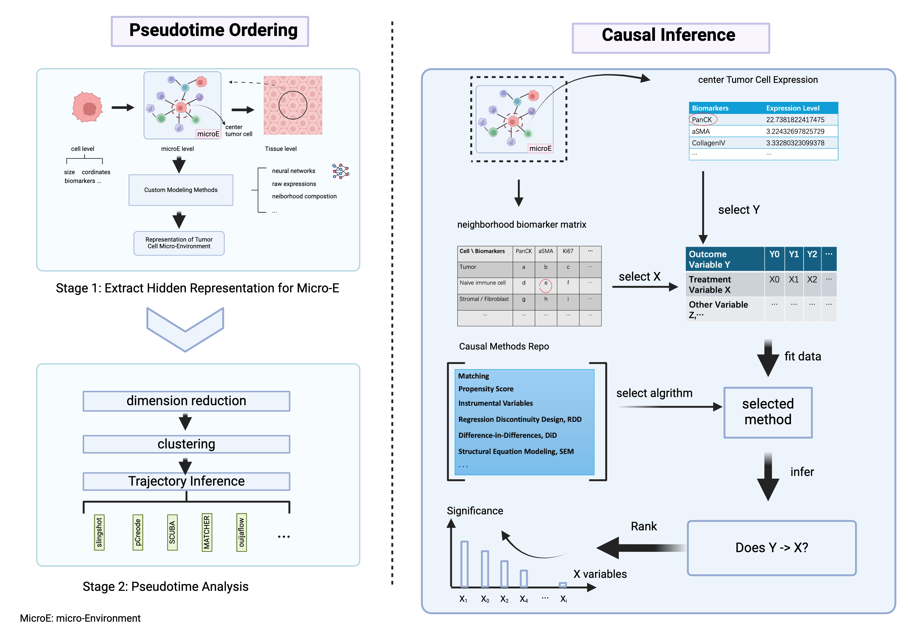
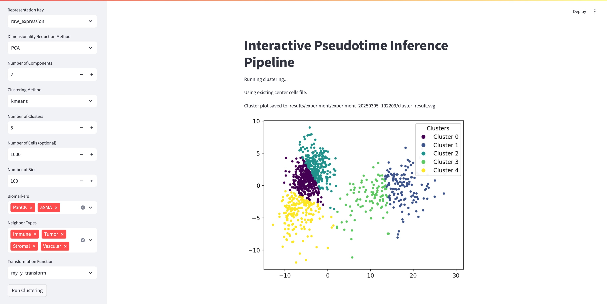
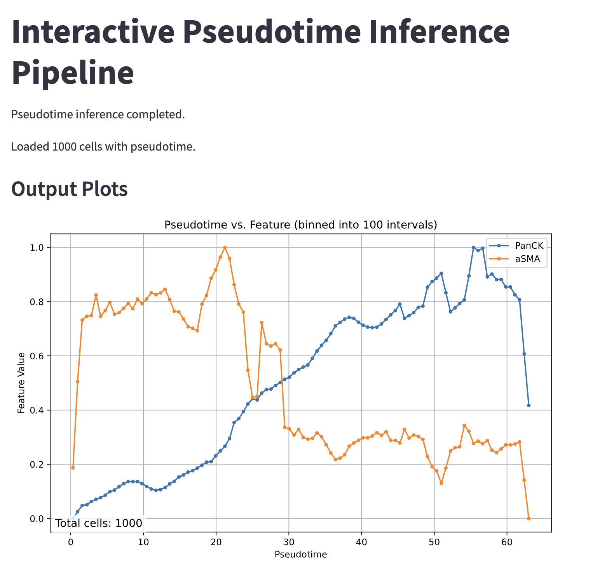

# TIC: Temporal Inference of Cells
Temporal Inference of Cells (TIC) is a computational framework for analyzing cellular micro-environments using graph-based pseudo-time analysis. It integrates tools for graph construction, embedding preparation, pseudo-time trajectory computation, and biomarker trend visualization. The framework aims to facilitate both Pseudotime Ordering (left side of the figure below) and Causal Inference (right side), enabling comprehensive analyses of how cellular states evolve over time and how various factors may influence these trajectories.

(Left) An overview of the pseudo-time analysis process: cells are embedded, clustered, and ordered along a trajectory to infer temporal progression.
(Right) A conceptual outline for causal inference on the resulting pseudo-time data, allowing exploration of how various factors or biomarkers may causally relate to outcome variables.
## Installation

To use TIC, follow these steps:

### Step 1: Clone the Repository
```
git clone https://github.com/cellethology/tic
cd tic
```
### Step 2: Install Dependencies
All dependencies can be installed in **one command**:
```bash
pip install -e .
```

### **Optional: Creating a Virtual Environment**
If you prefer to install TIC in an isolated environment, you can use `conda` or `venv`:

#### **Using Conda**
```bash
conda create -n tic_env python=3.10
conda activate tic_env
pip install -e .
```
#### **Using Virtualenv**
```bash
python -m venv tic_env
source tic_env/bin/activate  # On Windows: tic_env\Scripts\activate
pip install -e .
```
#### Verifying Installation
After installation, you can check if TIC is installed correctly:
```bash
python -c "import tic; print('TIC installed successfully!')"
```

## Project Framework
The directory structure for the TIC project is as follows:
```
TIC/
├── config/             # Configuration files (Hydra-based)
├── tic/               # Core modules for data processing and analysis
├── data/{dataset_root} # Directory for input datasets and intermediate files
    |—— Raw             # Your raw single cell csv files
    |—— Cache           # This will cache processed Cell, MicroE, Tissue Object
├── media/              # Pictures
├── scripts/            # Scripts for running experiments and pipelines
├── utils/              # Utility scripts and helper functions
├── Readme.md           # Project documentation
├── requirements.txt    # Python dependencies
└── setup.py            # Installation script

```
Key subdirectories and files include:
* tic/: Contains essential modules for data loading, feature extraction, and model definitions 
* scripts/: Houses pipeline scripts (like pseudotime_inference.py) that can be invoked from the command line to run end-to-end analyses.
* utils/: Provides helper functions, plotting utilities, and code to assemble user-friendly workflows or UIs.

## Pseudo-Time Inference
TIC supports a graph-based pseudo-time analysis workflow where you can:
1.	Extract or Load Cellular Representations: Each cell in the dataset is associated with features such as biomarker intensities or neighborhood composition.
2.	Dimensionality Reduction: Perform PCA or UMAP to embed high-dimensional data into 2D or 3D space.
3.	Clustering: Use KMeans or Agglomerative clustering to group cells.
4.	Trajectory Inference: Apply Slingshot to infer a pseudo-time ordering along one or multiple trajectories.
5.	Plotting: Visualize biomarkers or neighbor compositions along the inferred pseudo-time.

### 1）run from scripts
An example command-line workflow is provided in scripts/pseudotime_inference.py. You can invoke it as follows:
```
python scripts/pseudotime_inference.py \
  --cells_input "/path/to/center_cells.pt" \
  --cells_output "/path/to/cells_with_pseudotime.pt" \
  --representation_key "raw_expression" \
  --dr_method "PCA" \
  --n_components 2 \
  --cluster_method "kmeans" \
  --n_clusters 5 \
  --start_node 0 \
  --num_cells 10000 \
  --output_dir "/path/to/results"
```
Common arguments include:
*	--cells_input: Path to a .pt file containing a list of Cell objects.
*	--cells_output: Output path for the updated cells (with pseudo-time attached).
*	--representation_key: Which cell feature to use for dimensionality reduction and clustering (e.g., "raw_expression").
*	--dr_method and --cluster_method: Choose from "PCA"/"UMAP" and "kmeans"/"agg" respectively.
*	--n_components and --n_clusters: Dimensionality and number of clusters.
*	--start_node: Which cluster index to treat as the start of the trajectory (if omitted, Slingshot auto-detects).
*	--num_cells: Randomly select a subset of cells (useful for large datasets).
*	--output_dir: Directory to save output plots, updated cell files, and logs.
### 2）Use Simple UI(Recommended, user friendly)
For a more interactive experience, TIC provides a Streamlit-based UI in scripts/ui.py. To launch it:
```bash
python -m streamlit run scripts/ui.py 
```
Within the UI, you can:
1.	Specify dataset paths, representation options, and clustering parameters.
2.	Run the pipeline with a progress bar showing each step.
3.	View and save the resulting plots directly in the web interface, including:
	*	Cluster visualization with labeled centers
	*	Pseudo-time vs. Biomarkers
	*	Pseudo-time vs. Neighbor Composition
	*	Pseudo-time Distribution
	*	Slingshot Pseudotime Visualization
Below are some example screenshots from the UI:



## Adapting to a Different Single-Cell Dataset

TIC expects certain CSV files (coordinates, features, types, and expression) for each region or sample. By default, it looks for files named according to the patterns in `FILE_MAPPING` and reads columns based on the keys in `COLUMN_MAPPING`. If your dataset uses different file names or column names, you can edit these mappings to match your dataset.

### 1. File Naming Scheme

```python
FILE_MAPPING = {
    'coords': "{region_id}.cell_data.csv",
    'features': "{region_id}.cell_features.csv",
    'types': "{region_id}.cell_types.csv",
    'expression': "{region_id}.expression.csv"
}
```

*	Purpose: Tells TIC how to construct the filenames for each file type (e.g., coords, features) by inserting the region_id (or sample ID) into the format string.
*	How to Adapt: If your dataset uses a different naming convention, update the format strings. For example, if your files are named Sample123_cell_data.csv, change "{region_id}.cell_data.csv" to "{sample_id}_cell_data.csv", and ensure you pass sample_id="Sample123" when loading.

```python
COLUMN_MAPPING = {
    'coords': {
        'CELL_ID': 'CellID',
        'X': 'PosX',
        'Y': 'PosY'
    },
    'features': {
        'CELL_ID': 'CellID',
        'SIZE': 'Area'
    },
    'types': {
        'CELL_ID': 'CellID',
        'CELL_TYPE': 'Annotation'
    },
    'expression': {
        'CELL_ID': 'CellID'
    }
}
```

This way, TIC will know how to find the necessary columns in your CSV files.

Summary
1.	Update FILE_MAPPING to match how your dataset’s files are named.
2.	Update COLUMN_MAPPING so TIC knows which columns to read from your CSV files.
3.	Ensure you pass the correct region_id (or sample_id) when loading data, so TIC can locate the right files.

By making these changes, you can integrate virtually any single-cell dataset into the TIC framework, allowing you to leverage the existing pseudo-time inference, clustering, and visualization pipelines with minimal effort.
