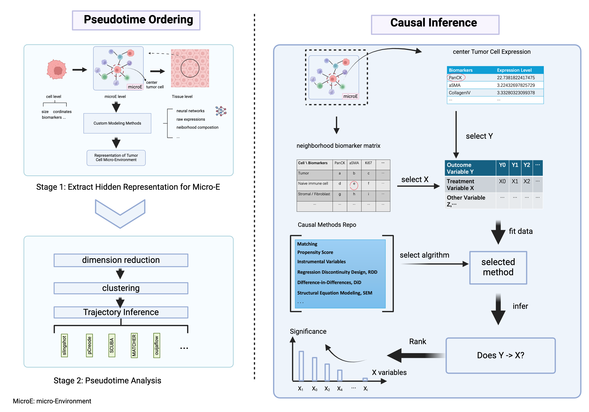

# TIC: Tumor Inference of Causality in EMT Progression
Tumor Inference of Causality (TIC) is a computational framework for analyzing cellular micro-environments using graph-based pseudo-time analysis. It integrates tools for graph construction, embedding preparation, pseudo-time trajectory computation, and biomarker trend visualization. The framework aims to facilitate both Pseudotime Ordering (left side of the figure below) and Causal Inference (right side), enabling comprehensive analyses of how cellular states evolve over time and how various factors may influence these trajectories.

(Left) An overview of the pseudo-time analysis process: cells are embedded, clustered, and ordered along a trajectory to infer temporal progression.
(Right) A conceptual outline for causal inference on the resulting pseudo-time data, allowing exploration of how various factors or biomarkers may causally relate to outcome variables.
## Installation

To use TIC, follow these steps:

### Step 1: Clone the Repository
```
git clone https://github.com/cellethology/tic
cd tic
```
### Step 2: Install Dependencies
All dependencies can be installed in **one command**:
```bash
pip install -e .
```

### **Optional: Creating a Virtual Environment**
If you prefer to install TIC in an isolated environment, you can use `conda` or `venv`:

#### **Using Conda**
```bash
conda create -n tic_env python=3.10 # min python version is 3.10
conda activate tic_env
pip install -e .
```
#### **Using Virtualenv**
```bash
python -m venv tic_env
source tic_env/bin/activate  # On Windows: tic_env\Scripts\activate
pip install -e .
```
#### Verifying Installation
After installation, you can check if TIC is installed correctly:
```bash
python -c "import tic; print('TIC installed successfully!')"
```

## Usage
see: [Readme.md](tic/README.md)